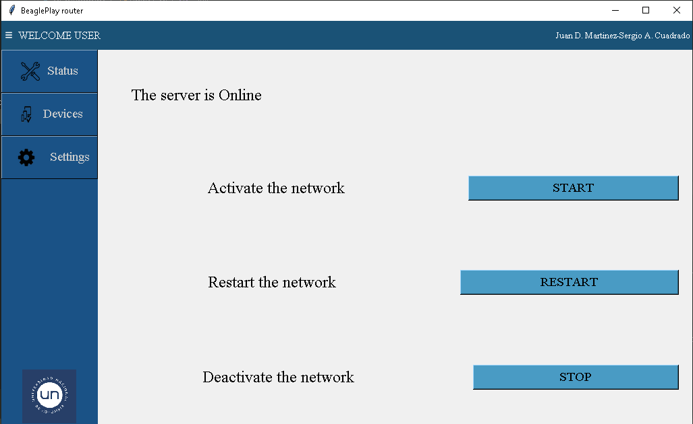

## Beagle play router
Configuración de la beagleplay para usarla como router, además de una interfaz de usuario para su monitoreo y configuración

# hostapd y isc-dhcp-server
-Instalar los sevicios
~~~
#sudo apt update
#sudo apt install hostapd 
#sudo apt install isc-dhcp-server

~~~

## Crear punto de acceso con 'hostapd'

Modo Router: cableada <-> wireless:

- Configuración de _/etc/hostapd/hostapd_:
~~~
ssid=BeaglePlayRouter #nombre de tu red
wpa_passphrase=BeaglePlay_  #clave de tu red
interface=wlan0
auth_algs=3
channel=6 #configurable por medio de la ui
driver=nl80211
hw_mode=g
logger_stdout=-1
logger_stdout_level=2
max_num_sta=5
rsn_pairwise=CCMP
wpa=2
wpa_key_mgmt=WPA-PSK
wpa_pairwise=TKIP 
~~~

- Activar bit de ipv4 forward
~~~
# sysctl -w net.ipv4.ip_forward=1
~~~

- Dejar el archivo configurado como default en _/etc/default/hostapd_:

~~~
DAEMON_CONF="/etc/hostapd/hostapd.conf"
~~~

## Configuración del DHCP

- Configuración del _etc/dhcp/dhcp.conf_:
 ~~~
    subnet 10.0.0.1 netmask 255.255.255.0 {
  range 10.0.0.10 10.0.0.100;
  option routers 10.0.0.254;
  option domain-name-server 8.8.8.8 ;}

 ~~~

- Configuración de una IP fija en _/etc/default/dhcp_:
~~~
auto wlan0
iface wlan0 inet static
    address 10.0.0.1
    netmask 255.255.255.0
~~~
 -Por último reiniciar el servidor
~~~
sudo systemctl restart isc-dhcp-server
sudo systemctl restart hostapd
~~~

## Requisitos para ejecutar la interfaz

-Python 3.11 o mayor
-Librerías:
~~~
pip install pillow
pip install tk
pip install subprocess
~~~
